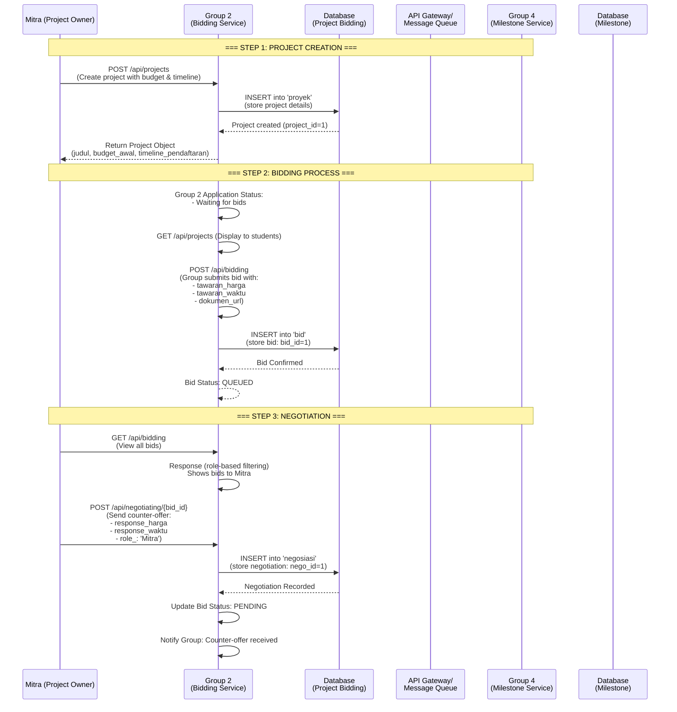

# Deal Data Flow Sequence Diagram

Visualization of how "Deal" data flows from Group 2 (Bidding Service) to Group 4 (Milestone Service) for milestone creation.

## Main Sequence Flow

## Integration with Group 4

Once a deal is finalized, the following information is sent to Group 4:

- Project ID
- Final Budget (budget_final)
- Final Timeline (waktu_final)
- Group ID
- Partner ID
- Project Details

This data enables Group 4 to create appropriate milestones for the project.
